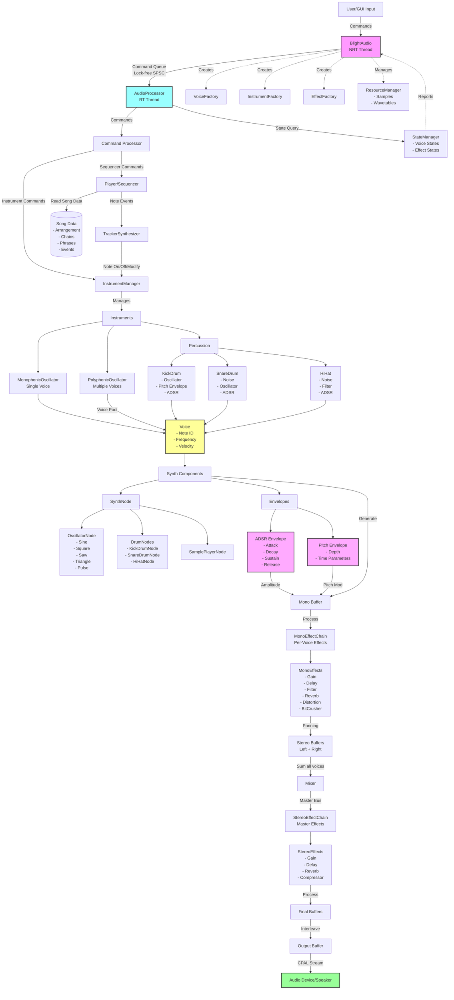

# blight-synth

blight-synth is a modular synthesizer application built in Rust, featuring a dedicated audio backend and a graphical frontend interface. The project is organized into several Rust crates and a frontend GUI (built with Tauri), enabling real-time audio synthesis and user interaction.

## Project Structure

- `audio_backend/` — Core audio engine. Handles audio device management, synthesis, streaming, and processing. Written in Rust.
- `sequencer/` — Sequencing and timing engine for pattern-based music composition. Written in Rust.
- `utils/` — Music theory utilities (notes, scales, etc.) for use by the synth engine. Written in Rust.
- `frontend/` — Graphical User Interface (GUI) for operating the synth, built with Tauri. (Details are in the folder; not covered here.)
- `assets/` — Data files for notes and other resources.
- `scripts/` — Utility scripts (e.g., for generating note data).

## audio_backend Architecture

The `audio_backend` crate is responsible for all audio processing and device management. Its architecture is modular and consists of the following main components:



## Main Dependencies

- [cpal](https://github.com/RustAudio/cpal): Cross-platform audio I/O in Rust.

## Details

- Audio streaming is managed by the `audio_backend` crate, which sets up and runs the audio stream using `cpal`.
- The synthesis engine (within `audio_backend`) supports multiple waveforms and envelopes, and is designed for extensibility.
- The `sequencer` provides timing and pattern-based composition capabilities like traditional trackers.

### Audio backend API (quick start)

- Unified command enum with domain subtypes:
  - Command::Transport(TransportCmd)
  - Command::Sequencer(SequencerCmd)
  - Command::Synth(SynthCmd)
  - Command::Mixer(MixerCmd)
- You can send subcommands directly using From, e.g. SynthCmd::PlayNote { ... }.into().

Instrument mode (no tracker feature at runtime):

```rust
// create engine
let mut audio = audio_backend::BlightAudio::new().unwrap();
// play a note
use audio_backend::SynthCmd;
audio.send_command(SynthCmd::PlayNote { voice: audio.get_voice_factory().create_voice(0, audio_backend::InstrumentDefinition::Oscillator, 0.0), note: 60, velocity: 127 }.into());
// stop
audio.send_command(SynthCmd::StopNote { voice_id: 0 }.into());
```

Tracker mode (sequencer-driven):

```rust
use std::sync::Arc;
use audio_backend::{SequencerCmd, TransportCmd};
let song = Arc::new(sequencer::models::Song::new("My Song"));
let mut audio = audio_backend::BlightAudio::with_song(song.clone()).unwrap();
audio.send_command(SequencerCmd::PlaySong { song }.into());
audio.send_command(TransportCmd::StopSong.into());
```

Feature flags
- Default features enable tracker integration. Non-tracker examples use `--no-default-features`.
- Example:
  - cargo run -p audio_backend --example cycle_waveforms --no-default-features
