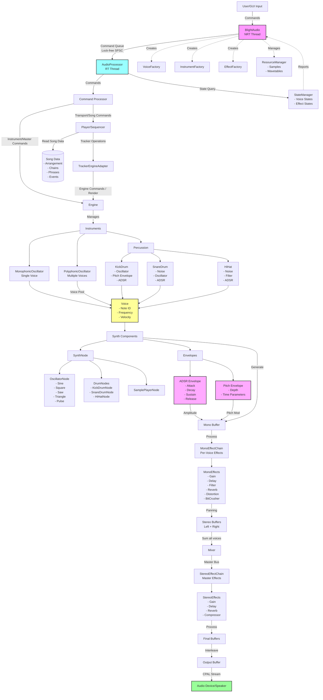

# blight-synth

blight-synth is an experimental composition environment and modular real-time sound engine built in Rust. The current repository includes a tracker-based composition source and egui debug interface while a host-independent engine and future Svelte/TypeScript frontend are being designed.

## Documentation and roadmap

- Start at [`docs/README.md`](docs/README.md) for the committed, Obsidian-compatible knowledge base.
- Coding agents should read [`AGENTS.md`](AGENTS.md) for the targeted context-loading and parallel-work protocol.
- GitHub issue [#144](https://github.com/jpalvarezl/blight-synth/issues/144) is the canonical roadmap; [`docs/work/burndown.md`](docs/work/burndown.md) is its generated offline snapshot.
- [`docs/spec/current-product.md`](docs/spec/current-product.md) records the current product direction and open composition questions.
- [`docs/architecture/product-topology.md`](docs/architecture/product-topology.md) documents standalone and optional-plugin boundaries, while [ADR 0001](docs/decisions/0001-product-and-host-priorities.md) records the accepted decision.
- [`docs/architecture/crate-dependency-graph.md`](docs/architecture/crate-dependency-graph.md) records the current CI-enforced M0 crate and feature boundaries.

GitHub Issues own live task status. Specifications, architecture contracts, and accepted decisions live in `docs/`; code and tests describe current implementation behavior.

## Project Structure

- `dsp/` — Portable DSP data and processing primitives: instruments, voices, effects, factories, and immutable sample data. It has no file/platform loader dependencies.
- `engine/` — Host-independent instrument runtime, planar mixer, and master-effects renderer. It owns no composition documents, devices, files, network sockets, or UI.
- `audio_backend/` — Tracker/offline adapters plus an optional default `standalone` feature containing CPAL, command transport, OSC, metering, and the temporary current-thread Tokio runtime.
- `sequencer/` — Current tracker document, timing, and `Song -> Chain -> Phrase` composition model.
- `tracker_gui/` — Current egui debug/reference interface; it does not dictate the future composition UI.
- `utils/` — Music theory utilities such as notes and scales.
- `os_dls/` — macOS DLS parsing and sample-resource support.
- `assets/` — Data files for notes and other resources.
- `scripts/` — Validation, smoke-test, and documentation tooling.

## Development checks

The hardware-free CI baseline has direct local equivalents:

```bash
cargo fmt --all -- --check
cargo clippy --workspace --all-targets -- -D warnings
cargo test --workspace --all-targets
cargo test -p audio_backend --no-default-features --all-targets
python3 scripts/check_architecture.py
python3 scripts/check_rt_logging.py
python3 scripts/docs/check_docs.py
```

See [`scripts/README.md`](scripts/README.md) for roadmap-generator and manual audio/OSC checks. TypeScript checks will be added when the production `gui/` workspace exists.

## Offline song rendering and golden regression tests

Render the supported synth/drum reference songs without opening an audio device:

```bash
scripts/render_reference_songs.sh
```

Or render one JSON song:

```bash
cargo run -p audio_backend --example render_song -- \
  calibration.json target/offline-renders/calibration.wav
```

On macOS, listen with `afplay target/offline-renders/calibration.wav`. CI compares canonical PCM SHA-256 references for the synth/drum songs. Intentional audio changes use the explicit reference-update workflow documented in [`docs/architecture/offline-render-contract.md`](docs/architecture/offline-render-contract.md); normal tests never rewrite references.

## audio_backend Architecture

The `audio_backend` crate is responsible for all audio processing and device management. Its architecture is modular and consists of the following main components:



## Main Dependencies

- [cpal](https://github.com/RustAudio/cpal): Cross-platform audio I/O in Rust.

## Details

- Audio streaming is managed by the `audio_backend` crate, which sets up and runs the audio stream using `cpal`.
- The synthesis engine (within `audio_backend`) supports multiple waveforms and envelopes, and is designed for extensibility.
- The `sequencer` provides timing and pattern-based composition capabilities like traditional trackers.

### Audio backend API (quick start)

- The standalone/tracker queue has domain-specific payloads:
  - `Command::Transport(TransportCmd)` — adapter transport.
  - `Command::Sequencer(SequencerCmd)` — song loading/playback.
  - `Command::Instrument(InstrumentCmd)` — instrument creation, notes, synth control, and instrument-owned effects.
  - `Command::Mixer(MixerCmd)` — master mixer/effect pipeline only.
- `InstrumentCmd` and `MixerCmd` are owned by `engine` and compatibility-re-exported by `audio_backend`.
- Subcommands convert into the queue envelope with `.into()`.

Direct instrument control through the current standalone adapter:

```rust
let mut audio = audio_backend::BlightAudio::new().unwrap();
let instrument_id = 1;
let instrument = audio
    .get_instrument_factory()
    .create_simple_oscillator(instrument_id, 0.0);

audio.send_command(audio_backend::InstrumentCmd::AddInstrument { instrument }.into());
// Current adapter rendering is transport-gated; M1 will separate live rendering from tracker transport.
audio.send_command(audio_backend::TransportCmd::PlayLastSong.into());
audio.send_command(
    audio_backend::InstrumentCmd::NoteOn {
        instrument_id,
        note: 60,
        velocity: 127,
    }
    .into(),
);
audio.send_command(audio_backend::InstrumentCmd::NoteOff { instrument_id }.into());
```

Tracker mode (sequencer-driven):

```rust
use std::sync::Arc;
use audio_backend::{SequencerCmd, TransportCmd};
let song = Arc::new(sequencer::models::Song::new("My Song"));
let mut audio = audio_backend::BlightAudio::with_song(song.clone()).unwrap();
audio.send_command(SequencerCmd::PlaySong { song }.into());
audio.send_command(TransportCmd::StopSong.into());
```
