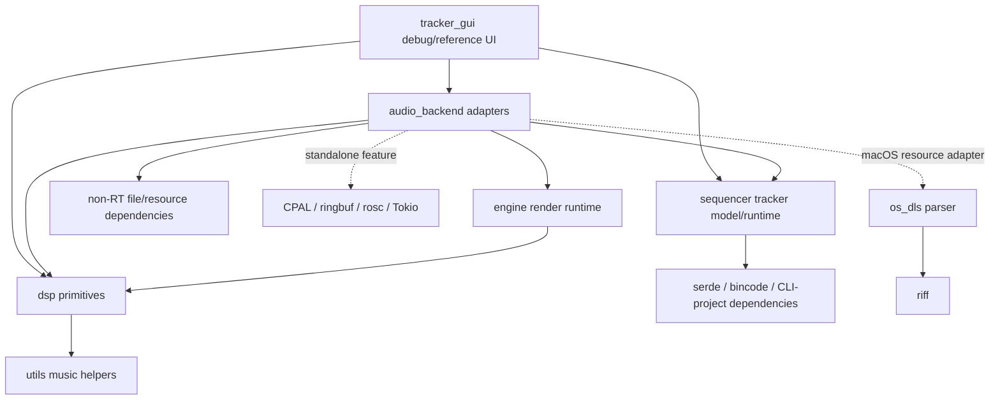

# M0 Crate Dependency Graph



## Enforced responsibilities

| Crate | Owns | Must not own |
|---|---|---|
| `dsp` | Synth nodes, voices, envelopes, effects, factories, immutable sample data | Engine orchestration, composition documents, CPAL/OSC/Tokio, file/platform loading, UI |
| `engine` | Deterministic instrument slots, instrument/master commands, planar mixing, master effects | Sequencer/tracker types, devices, network/async runtime, files/resources, UI |
| `sequencer` | Current tracker `Song -> Chain -> Phrase` document/timing runtime and project serialization | DSP/engine/device/network/UI dependencies |
| `utils` | Small music-theory/data helpers | DSP/engine/sequencer/host/UI/file-decoder dependencies |
| `os_dls` | DLS/RIFF parsing | Engine/DSP/host orchestration |
| `audio_backend` host-free | Tracker adapter, shared hydration, resources, deterministic offline rendering | A duplicate DSP/engine implementation |
| `audio_backend` `standalone` feature | CPAL callback/queue adaptation, metering, OSC, process entry point, temporary current-thread Tokio runtime | Composition or DSP semantics duplicated from reusable layers |
| `tracker_gui` | Current egui debug/reference workflow | Production frontend architecture |

## Exact portable dependency allowlists

CI requires:

```text
engine   -> dsp
dsp      -> arrayvec, log, utils
utils    -> serde, serde_json
sequencer -> anyhow, bincode, clap, serde, serde_json, serde_with
os_dls   -> riff
```

Any new portable-crate dependency is an architecture change and must update both this page and `scripts/check_architecture.py` deliberately.

## Standalone target boundary

`audio_backend` defaults to feature `standalone` for current applications. CPAL, ringbuf, rosc, env_logger, and Tokio are optional and enabled only by that feature. The `dsp-core` binary and device/network examples require it. `render_song`, `update_offline_references`, tracker composition, resources, and offline golden tests compile with `--no-default-features`.

Tokio currently uses its current-thread runtime. M2 issue #161 removes it after protocol/lifecycle behavior is stable.

## Transitional compatibility

`audio_backend` intentionally re-exports `dsp`, `engine`, and standalone types so existing examples and `tracker_gui` can migrate incrementally. This is a public-surface compatibility shim, not permission for reusable crates to depend back on `audio_backend`. M1 issue #132 owns the final engine-facing lifecycle/API and should decide when these broad re-exports can be narrowed.
