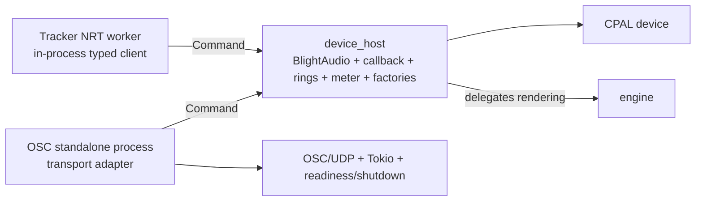

# Device Host Boundary (Draft)

Draft contract page for the split recorded (Status: Proposed) in
[ADR 0002](../decisions/0002-device-host-osc-split.md) (deciding issue
[#185](https://github.com/jpalvarezl/blight-synth/issues/185)). This is a
routing/contract page, not a copy of source. It becomes non-draft when the
follow-up implementation lands.

## Read first

1. [ADR 0002 — device host vs OSC split](../decisions/0002-device-host-osc-split.md)
2. [Target system boundaries](../architecture/system-boundaries.md)
3. [Real-time audio contract](../architecture/realtime-contract.md)
4. [Standalone host domain](../domains/standalone-host.md)

## Two layers

- **`device_host`** (feature `device-host`): reusable in-process host. Owns the
  CPAL stream, RT callback adapter, bounded command/retirement rings, metering,
  and NRT factories/resources. Exposes the typed control interface
  `BlightAudio` over the host-neutral `Command` envelope.
- **standalone process** (feature `standalone-process`, depends on
  `device-host`): OSC transport adapter. Owns `OscServer`, protocol mapping,
  meter encoding, the control worker's OSC request/response policy, process
  readiness/shutdown, and the temporary Tokio runtime.

`standalone` is retained as a compatibility alias of `standalone-process`.

## Invariants

- OSC is a transport adapter, not a control owner. It decodes packets into the
  same `Command`s a Rust client submits; it introduces no device-host semantics.
- Both first-party clients (tracker `AudioManager`, standalone control worker)
  are NRT owners that submit through `BlightAudio`.
- `--no-default-features` compiles neither layer; offline/tracker composition
  stays host-free.
- Tokio (#161) and command-traffic classes (#101/#134) evolve *behind* the
  device-host interface; the OSC mapping updates without gaining semantics.

## Status

Target boundary is recorded; no modules, features, or examples are moved yet.
Implementation is recommended for **M2** ([#190](https://github.com/jpalvarezl/blight-synth/issues/190)) per issue #185.
