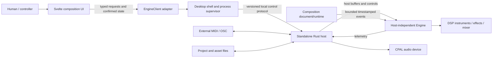
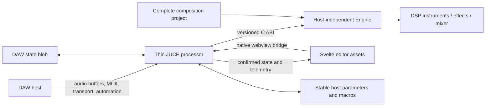

# Product and Host Topology

This page expands [ADR 0001](../decisions/0001-product-and-host-priorities.md) into concrete product/host boundaries. It does not select the final tracker, ORCA-like, hybrid, or other composition interaction.

## Priority and host matrix

| Target | Priority | Audio owner | Composition/UI | Distribution intent |
|---|---|---|---|---|
| Offline test/render harness | Required engineering host | Host-independent Rust engine | Test event sources and fixtures | Developer/CI only |
| Standalone desktop application | Primary product | CPAL standalone host drives shared engine | Compiled Svelte UI; final composition model remains open | First distributable product |
| VST3 / desktop AU | Optional | DAW/JUCE drives the same engine through C ABI | Same compiled Svelte UI behind native bridge | Only after standalone proves useful |
| AUv3 | Optional, feasibility-gated | AUv3/JUCE host drives the same engine | Embedded assets or documented platform fallback | Target platforms decided in #141 |
| Separate instrument-only plugins | Deferred/non-goal | — | — | Reconsider only with a superseding ADR |

## Primary standalone topology

The exact desktop shell remains open. Browser components never own UDP sockets, child processes, CPAL devices, or filesystem paths directly.

### Standalone authority

| State | Authority | Mirrors/consumers |
|---|---|---|
| Composition document, instruments, routing, engine parameters | Versioned Rust engine/project snapshot | UI confirmed stores; file adapter |
| Local desired/pending edits | UI store until confirmation | Standalone protocol request |
| Audio transport and render position | Engine, driven by selected clock/input source | UI telemetry |
| Project file operation | Standalone host adapter | Engine snapshot and UI result |
| Parameter descriptors, mapping, smoothing policy | Canonical Rust parameter manifest | UI-generated controls and protocol adapter |
| External MIDI/OSC/file side effects | Standalone host | Composition runtime emits abstract requests only |
| Device configuration and process lifecycle | Standalone shell/host | UI connection state |

The UI must distinguish desired, pending, and engine-confirmed state. It is not a second authoritative project model.

## Optional plugin topology

A plugin, if built, owns one complete isolated composition/audio engine and project. It does not spawn Bun/Vite, open CPAL, launch a standalone DSP process, or use fixed OSC ports for its editor.

### Optional plugin authority

| State | Authority | Notes |
|---|---|---|
| Complete project and dynamic node parameters | Rust engine snapshot | Serialized into the DAW state blob through the host adapter |
| Fixed DAW-visible globals and macro slots | JUCE/APVTS host surface | Stable IDs; values are forwarded to the engine manifest |
| UI gesture lifecycle | Native bridge/APVTS | Begin/change/end gestures; no automation feedback loop |
| Audio/MIDI/transport | DAW | Sample offsets preserved through C ABI |
| Meter/editor telemetry | Engine, throttled by JUCE bridge | Never requires networking |
| Plugin lifecycle and channel layout | DAW/JUCE | One isolated engine handle per instance |

Dynamic project-defined effect/instrument parameters are not automatically added to the DAW parameter list. Stable macros provide host automation without invalidating saved automation when a project changes.

## Composition boundary

The audio engine consumes bounded timestamped events. The current tracker `Song -> Chain -> Phrase` player becomes one implementation of the #145 event-source contract; future ORCA-like or hybrid runtimes use the same boundary.

Composition runtimes own document semantics, clock interpretation, deterministic seeds/checkpoints where promised, and abstract outbound events. They do not own DSP objects, audio devices, sockets, or filesystem operations.

## Runtime and platform constraints

- The RT process path performs no allocation/deallocation, locking, logging, filesystem/network I/O, panic, or unbounded work.
- Standalone control may use local OSC initially, but the public protocol is versioned and separate from internal Rust command enums.
- Release Svelte assets are compiled and work without a Vite development server.
- Plugin requirements do not block M0–M3 or determine the standalone composition UX.
- AUv3 remains feasibility-gated because sandbox, lifecycle, state-size, memory, webview, and containing-app requirements differ from desktop plugins.
- Project state must not rely solely on absolute filesystem paths if it is ever embedded in DAW/AUv3 state.

## Explicit non-goals

- Rebuilding a general-purpose DAW or cloning Renoise/ORCA feature-for-feature.
- Separate plugin products for each current instrument.
- A runtime-loaded third-party DSP plugin SDK in the initial architecture.
- Exposing every dynamic project parameter as a DAW parameter.
- Using Bun, Vite, localhost servers, or OSC as a shipped plugin editor dependency.
- Selecting the final standalone shell or composition language in M0.
