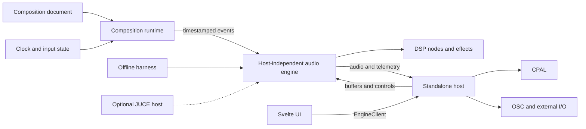

# Target System Boundaries

## Dependency direction

- DSP primitives know nothing about composition documents or hosts.
- The audio engine consumes bounded timestamped events and host-provided buffers.
- Composition runtimes know event semantics but do not perform audio-device or network I/O.
- Hosts own devices, processes, filesystem access, external MIDI/OSC, and UI bridges.
- UI code depends on a typed host-neutral client, not CPAL, UDP, or Rust internals.

## Current-to-target note

The `engine` crate now owns generic instrument dispatch, instrument/master command types, planar mixing, and master effects. `MixerCmd` is master-only; instrument effect operations belong to `InstrumentCmd`. `audio_backend` still combines CPAL, `AudioProcessor`, tracker `Player`/track state, the compatibility command envelope, OSC, resources, and project hydration. The remaining M0/M1 issues linked in frontmatter own host, composition, and semantic separation. Until they land, code and tests describe current behavior.

## Parallelization boundary

Changes to event schemas, parameter IDs, state formats, public engine lifecycle, or workspace dependencies are contract changes. They require one coordinated owner and should not be modified independently by parallel tasks.
