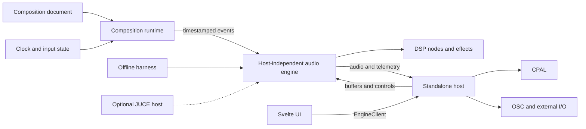

# Target System Boundaries

## Dependency direction

- DSP primitives know nothing about composition documents or hosts.
- The audio engine consumes bounded timestamped events and host-provided buffers.
- Composition runtimes know event semantics but do not perform audio-device or network I/O.
- Hosts own devices, processes, filesystem access, external MIDI/OSC, and UI bridges.
- UI code depends on a typed host-neutral client, not CPAL, UDP, or Rust internals.

## Current-to-target note

The M0 mechanical boundaries are complete and enforced in the [current crate dependency graph](crate-dependency-graph.md). The `engine` crate owns generic instrument dispatch, instrument/master command types, deterministic planar mixing, and master effects. `audio_backend` provides the tracker adapter, shared hydration, resources, and deterministic offline rendering in host-free builds. Its optional default `standalone` feature contains CPAL, callback/queue adaptation, metering, OSC, and the temporary current-thread Tokio runtime under `audio_backend/src/standalone/`. The committed JSON-song PCM references characterize the shared render path before M1 defines final composition/events, timing, routing, parameters, and state semantics.

## Parallelization boundary

Changes to event schemas, parameter IDs, state formats, public engine lifecycle, or workspace dependencies are contract changes. They require one coordinated owner and should not be modified independently by parallel tasks.
